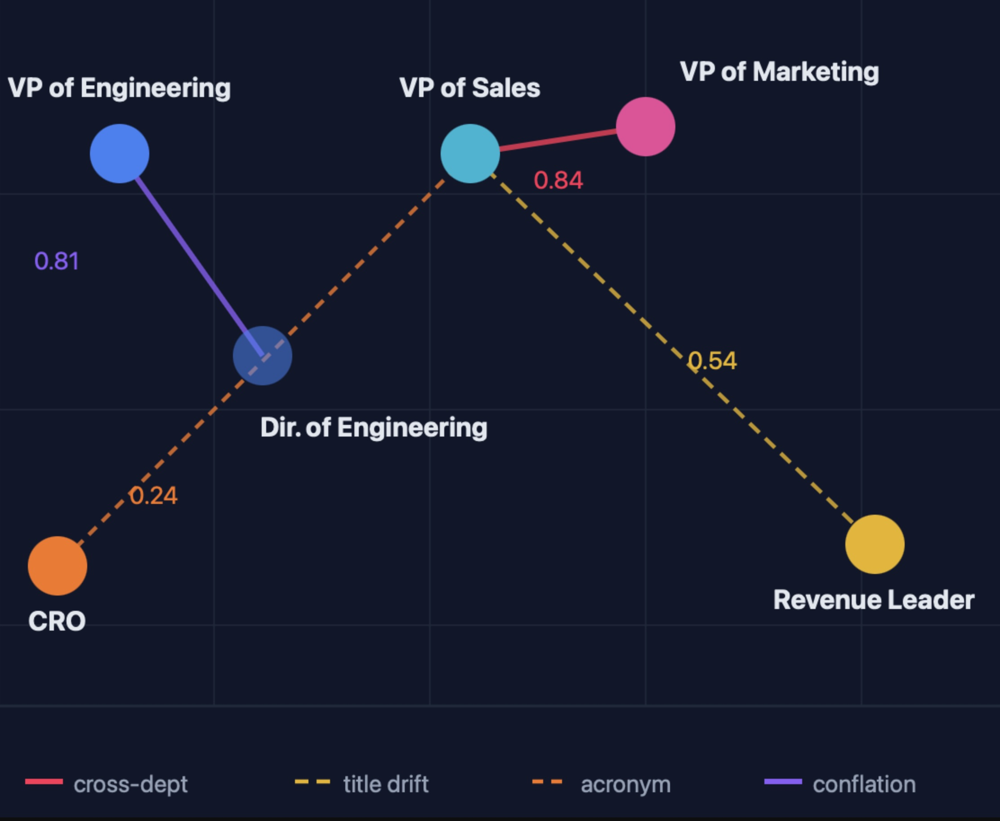
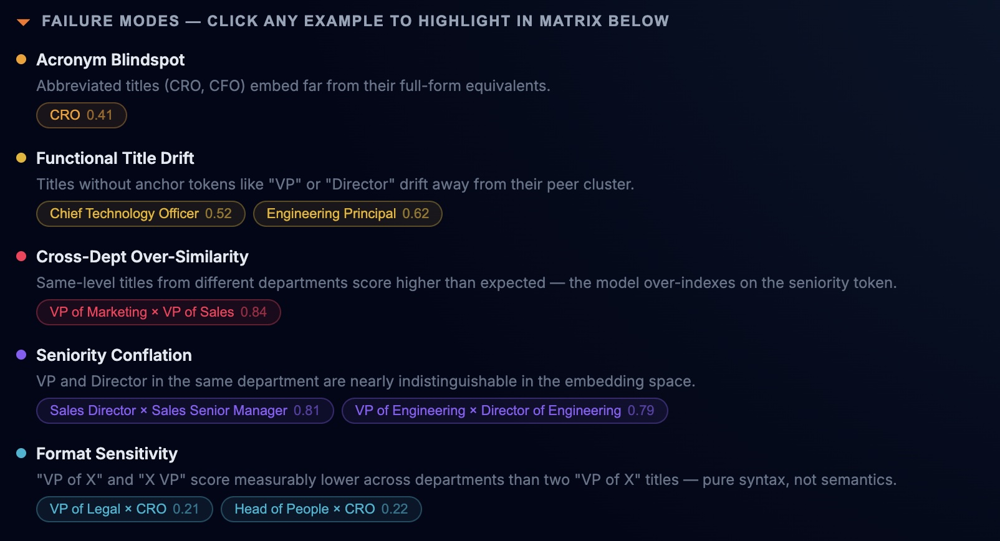
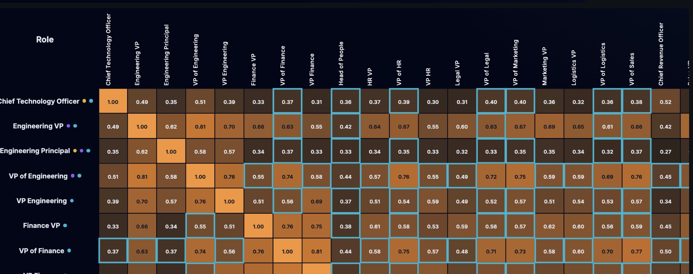
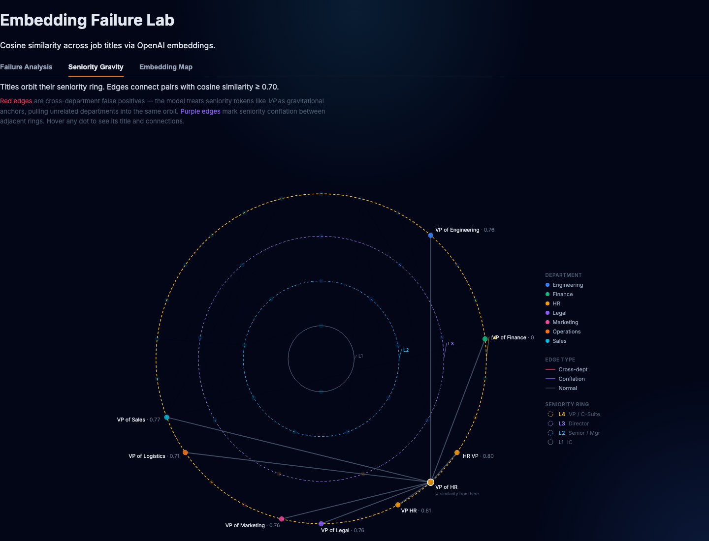
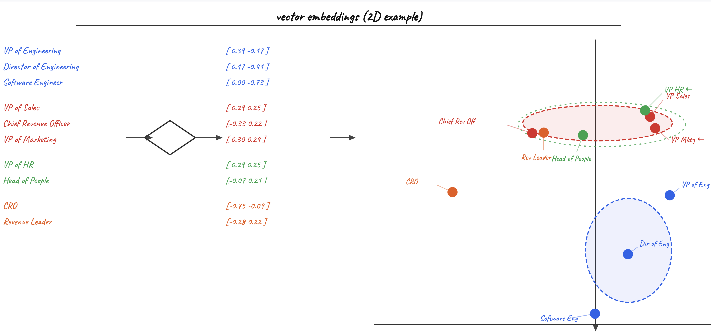

# Embedding Blind Spots — Five ways OpenAI embeddings distort job titles.

   

A live diagnostics sandbox for OpenAI title embeddings. Builds an NxN cosine similarity matrix across 46 job titles and surfaces five systematic failure modes — with cosine scores for each.



*Each node is a title, edge thickness scales with cosine similarity*

---

## Overview — What This Exposes

| Failure Pattern | How This Project Surfaces It |
|---|---|
| **Functional Title Drift** | Titles without anchor tokens like `VP` or `Director` drift away from their expected cluster, measurably quantified per title |
| **Cross-Departmental Over-Similarity** | The model produces false-positive matches (`VP of Sales` ↔ `VP of Marketing` at **0.84**) that would cause incorrect results in any threshold-based matching pipeline |
| **Seniority Conflation** | A **0.05 delta** separates a seniority boundary from a departmental one; a system calibrated on small data would fail systematically across thousands of titles |
| **Syntactic Format Sensitivity** | The model clusters by surface form as much as by meaning — `"VP of X"` titles score higher with each other than with semantically equivalent `"X VP"` titles (**0.74** vs **0.55**) |
| **Acronym Blindspot** | `CRO` is ambiguous (`Chief Revenue Officer? Chief Risk Officer? Contract Research Org?`) so the embedding averages across meanings and collapses to **0.16–0.41**, while `Chief Revenue Officer` scores **0.50+** — proving that acronym expansion before embedding is mandatory |

### Dashboard

The dashboard has three tabs:

**Failure Analysis** — the primary view. An NxN cosine similarity heatmap across all 46 titles; hover any cell to see the exact score. Toggle partition modes (seniority / department) to zero out cross-boundary similarities and compare raw embeddings against a hard-partitioned system. The failure panel below lists every detected anomaly with the pair, score, and failure type.
<details><summary>📸 Failure mode breakdown</summary>

</details>

> **Reading the scores:** production title-matching pipelines typically use a threshold of ~0.75 to flag a match. Scores above that between titles from *different* departments or seniority levels are false positives. That's why a 0.84 between `VP of Sales` and `VP of Marketing` is the key finding — it's above the typical match threshold.

<details><summary>📸 Cosine similarity matrix</summary>


*Cosine similarity matrix (left) · Failure mode breakdown (right)*
</details>

**Seniority Gravity** — titles orbit concentric rings by seniority level (L1 IC → L4 VP/C-Suite). Edges connect pairs with cosine similarity ≥ 0.70. Red edges are cross-department false positives — the model treats seniority tokens like `VP` as gravitational anchors, pulling unrelated departments into the same orbit. Purple edges mark seniority conflation between adjacent rings. Hover any dot to see its title and connections.

<details><summary>📸 Seniority Gravity screenshot</summary>

</details>

**Embedding Map** — a 2D PCA scatter plot of all 46 title vectors, computed client-side via power-iteration PCA. Shows how the model actually clusters titles in its vector space, independent of the similarity scores.

---

## Findings

### Key Findings

#### Areas of Success

| Pair | Score | Signal |
|---|---|---|
| *HR VP / VP HR / VP of HR* | **0.80–0.85** | Word order doesn't change the role — the model gets this right |
| *Director of Engineering* ↔ *VP of Engineering* | **0.79** | Adjacent seniority, same department — strong relationship maintained |

#### Failure Cases

##### 🔤 Acronym Blindspot
`CRO` is ambiguous across four expansions — the embedding averages across meanings and collapses into noise. Any pipeline that skips acronym expansion will systematically fail to match C-suite roles.
- *Chief Revenue Officer* vs. other executive titles → **0.50+**
- *CRO* (same role, acronym form) → **0.16–0.41** — scores just **0.24** against VP of Sales, while unrelated *Software Engineer* (**0.34**) scores higher

##### 🔡 Syntactic Format Sensitivity
The model clusters by grammatical pattern as much as by meaning — `"VP of X"` titles score higher with each other than with semantically equivalent `"X VP"` titles.
- *VP of Engineering* ↔ *VP of Finance* (same format, different dept) → **0.74**
- *VP of Engineering* ↔ *Finance VP* (different format, different dept) → **0.55**

##### 🏢 Cross-Departmental Over-Similarity
The model over-indexes on seniority tokens like `VP`, collapsing functional boundaries between unrelated departments.
- *VP of Sales* ↔ *VP of Marketing* → **0.84** — higher than many same-title word-order variants

##### 📊 Seniority Conflation
VP and Director are separated by the same margin as VPs across departments — a **0.05 delta** is the only thing between a seniority boundary and a departmental one.
- *VP of Engineering* ↔ *Director of Engineering* (same dept, different level) → **0.79**
- *VP of Engineering* ↔ *VP of Finance* (same level, different dept) → **0.74**

##### 🌀 Functional Title Drift
Non-canonical titles drift from their formal equivalents. `VP` and `Director` anchor embeddings toward executive space; titles without those tokens drift to a weak centroid.
- *Revenue Leader* ↔ *VP of Sales* → **0.54** — same role; *VP of Marketing* (different dept) scores **0.84** against the same title
- *Head of People* ↔ *VP of HR* → **0.60** — same function, same level
- *Sales Principal* vs. cross-domain VP titles → **< 0.40** despite seniority level 4

---

## Conclusion

Raw embeddings provide a strong baseline for functional grouping but fail at **precise entity resolution** and **seniority mapping**. The five failure modes above are not edge cases — they reflect systematic gaps that appear whenever titles deviate from a canonical `"[Level] of [Department]"` format. A production title-matching system needs at minimum: acronym expansion, title normalization, and a seniority signal that does not rely on the embedding alone.

---

## Usage & Background

### Quick Start

**No API key needed** — embedding vectors are pre-calculated and committed. The matrix loads immediately.

```bash
npm install
npm run dev       # → http://localhost:3000
```

### Extend It

Rename `.env.example` to `.env.local`, add your OpenAI API key, add titles to `src/data/library.json`, then:

```bash
npm run seed    # generate embeddings for any titles with empty vectors
npm run clear   # wipe all vector data (useful for resetting to a clean state)
```

### Background

#### What are embeddings?

An embedding model converts text into a high-dimensional numeric vector — a list of 1,536 numbers in this case. The position of that vector in space encodes meaning: words and phrases the model considers semantically related end up geometrically close together. This is what makes embeddings useful for tasks like search, clustering, and matching.

#### What is cosine similarity?

Cosine similarity measures the angle between two vectors, returning a value between 0.0 and 1.0. A score of **1.0** means the vectors point in exactly the same direction (identical meaning); **0.0** means they are orthogonal (no relationship). The metric ignores vector magnitude, so it compares meaning rather than word count or document length.

```
similarity = (A · B) / (|A| × |B|)
```

#### Why does this matter for job titles?

Title matching is a hard problem because the same role can be written dozens of ways (`VP of Sales`, `Sales VP`, `Head of Revenue`, `CRO`). Embedding-based matching is the natural tool — but only if the model encodes *meaning* consistently. This project shows that `text-embedding-3-small` encodes **surface form** as strongly as meaning, which breaks any pipeline that treats raw cosine similarity as a reliable match signal without preprocessing.

<details><summary>📸 Embedding space visualization</summary>

</details>

### Methodology

- **Model:** OpenAI text-embedding-3-small
- **Metric:** Cosine Similarity [0.0 - 1.0]
- **Dataset:** 46 professional job titles across Engineering, Finance, HR, Legal, Marketing, and Sales.

*All scores are properties of `text-embedding-3-small`'s vector space — switching models requires full re-embedding, as a different model may resolve some failure modes while introducing others.*

### Tech Stack

- **Framework:** Next.js 14 (App Router)
- **Language:** TypeScript
- **Embeddings:** OpenAI `text-embedding-3-small` via REST API
- **Analytics:** custom cosine similarity + PCA — no ML library dependency
